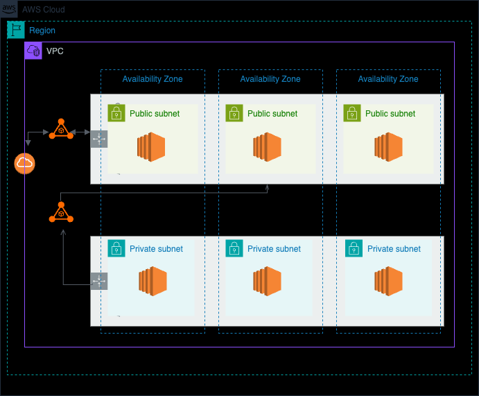

# Ansys-terraform-coding-challenge
Create a Virtual Private Cloud (VPC) with both public and private subnets across multiple availability zones. Next provision an EC2 instance in which a hypothetical nginx running on port 80 will later be installed. Ensure that this box is reachable over HTTP (port 80) by IP address

### **Requirements**
- Utilize Terraform to provision resources.
- Create a VPC with CIDR block `10.0.0.0/16`.
- Create **three public subnets** across different availability zones within the VPC.
- Create **three private subnets** across different availability zones within the VPC.
- Ensure that instances in the public subnets have internet access.
- Ensure that instances in the private subnets do not have direct internet connectivity.
- Parameterize Terraform code for **reusability and flexibility**.
- Ensure meaningful commit messages that convey the thought process.
- Code should **contain NO comments**.

---

## **Additional Information**
- **AWS Credentials**: Ensure you have the necessary AWS credentials configured for Terraform to access AWS services.
- **Reasonable Assumptions**: You may make reasonable assumptions for any details not explicitly provided.
- **Module Restrictions**: Do not leverage Terraform modules or existing community modules.
- **Code Quality**: The solution should focus on clean, straightforward, and minimal code while meeting all requirements.

---

## **Pre-requisites**
- **terraform**
- **aws-cli**

## Architecture Diagram


## **How to Use**

1. **Clone the Repository**:
   ```bash
   git clone https://github.com/rdorkadi/ansys-terraform-coding-challenge.git
   ```

2. **Configure AWS**:
    ```bash
    aws configure
    ```
3. **Initialize Terraform**:
    ```bash
    terraform init
    ```
4. **Plan and Apply**:
    ```bash
    terraform plan
    terraform apply
    ```
5. **Destroy Resources**:
    ```bash
    terraform destroy
    ```


